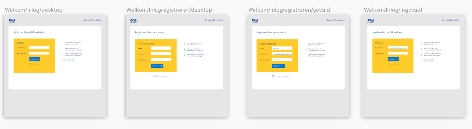
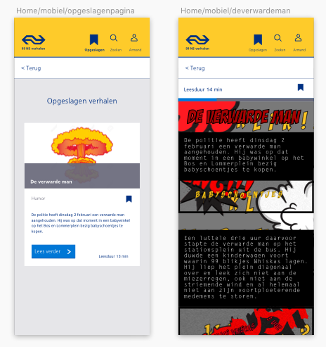
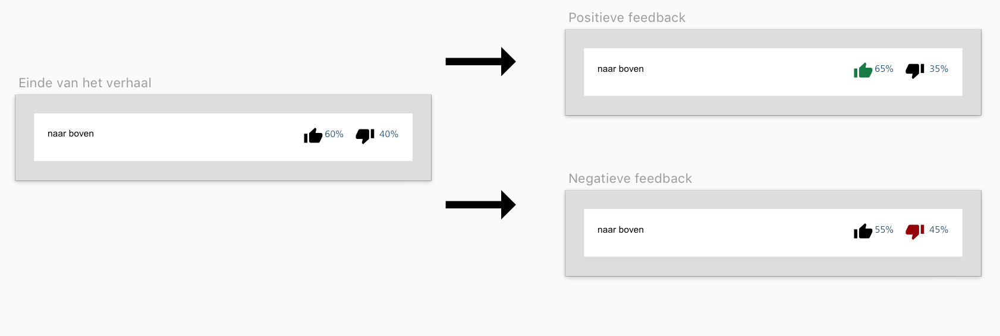

# 99 NS verhalen | Project web CMD 

99 NS verhalen is een verhalen website waar de gebruiker unieke verhalen kan lezen tijdens, voor en na de reizen met de Nederlandse Spoorwegen.  Het is een website die beschikbaar is voor alle apparaten en browsers een in elke context de gebruiker een unieke ervaring kan meegeven. 

[Bekijk hier het protype](https://armandbissesar.github.io/99-NS-verhalen-2019/index.html)

## Inhoudsopgave

* [Auteur](https://github.com/armandbissesar/99-NS-verhalen-2019/blob/master/README.md#auteur)
* [Het concept](https://github.com/armandbissesar/99-NS-verhalen-2019/blob/master/README.md#het-concept)
* [Multi device wireflow](https://github.com/armandbissesar/99-NS-verhalen-2019/blob/master/README.md#multi-device-wireflow)
    * Responsive gebruikerservaring 
        * [Voor de reis](https://github.com/armandbissesar/99-NS-verhalen-2019/blob/master/README.md#het-concept)
        * [Tijdens de reis](https://github.com/armandbissesar/99-NS-verhalen-2019/blob/master/README.md#tijdens-de-reis)
        * [Na de reis](https://github.com/armandbissesar/99-NS-verhalen-2019/blob/master/README.md#na-de-reis)

* [Microinteracties](https://github.com/armandbissesar/99-NS-verhalen-2019/blob/master/README.md#micro-interacties)
    * [Bookmarken](https://github.com/armandbissesar/99-NS-verhalen-2019/blob/master/README.md#bookmark)
    * [Beoordelen](https://github.com/armandbissesar/99-NS-verhalen-2019/blob/master/README.md#beoordelen)
* [De verwarde man](https://github.com/armandbissesar/99-NS-verhalen-2019/blob/master/README.md#het-verhaal-de-verwarde-man)
* [Conclusie](https://github.com/armandbissesar/99-NS-verhalen-2019/blob/master/README.md#conclusie)

## Auteur

* Armand Bissesar 
* 500727671 
* Project web 

## Het concept

99 NS verhalen is een interactieve verhalen website met unieke verhalen voor de reizigers van de NS. Ik heb gekozen voor *continuous* strategie. Dit houd in dat mijn multidevice ervaring een doorlopende ervaring is. De 99 NS-verhalen zullen dus ongeacht pc, tablet of telefoon, een geweldige leeservaring bieden aan de gebruiker.
In mijn concept wordt de gebruiker geholpen met het kiezen van een verhaal waar de gebruik zin in heeft. Dit wordt gedaan door middel van 
de genres. Door deze te koppelen met een tijd is het ideaal voor de gebruiker die een passend verhaal zoekt voor het juiste moment.
De gebruiker kan een deel van een verhaal lezen en deze opslaan om bijvoorbeeld later te lezen. De website laat de gebruiker kiezen wanneer het beste moment is voor de gebruiker om een verhaal te ervaren. 
De website is gemaakt op basis van de NS huisstijl.

Hieronder is mijn visual research te bekijken van de NS huisstijl:

Bekijk de volledige visual research in mijn sketch bestand(@moodle).

## Multi device wireflow

Hieronder leg ik uit hoe de flow en gebruikerservaring van de website werkt in context.

---

### Voor de reis: **1. Verhalen ontdekken, inloggen en bookmarken.(Desktop)**

1. Armand wilt graag op zijn laptop bekijken, welk verhaal hij later in de trein wilt gaan lezen op zijn mobiel. 

2. Hij bezoekt de website van 99 NS verhalen.

3. Hij wordt welkom geheten en ziet het verhalen overzicht. Armand heeft zin in een grappig verhaal dat langer duurt dan 10 minuten ivm zijn reis. Deze eisen verwerkt
hij in het filter systeem. Hij laat de verhaal gesorteerd op aanbevolen. Hij ziet dat de verhalen automatisch meefilteren. De verwarde man lijkt hem een leuk
verhaal en hij wilt deze opslaan(bookmarken).

4. Zodra hij hierop klikt krijgt hij een melding om in te loggen of een account te maken.

5. Nadat hij een account heeft aangemaakt, klikt hij op inloggen en ziet hij dat er boven aan de websit, een nieuwe pagina genaamd opgeslagen is toegevoegd aan het menu.
Daarnaast ziet hij dat de verwarde man is opgeslagen.

6. Armand heeft zijn verhaal opgeslagen en is klaar voor zijn trein reis.

### Tijdens de reis: **2. Inloggen op mobiel, opgeslagen pagina bekijken en verhaal lezen.(mobiel)**

1. Armand gaat naar de mobiele website en logt in.

2. Hierna klikt hij op opgeslagen verhalen. Vervolgens klikt hij op *lees verder* om zijn verhaal te beginnen.
Armand leest het verhaal: de verwarde man.

3. 6 minuten gaan zo voorbij en Armand is bijna op zijn bestemming. Hij heeft zijn verhaal niet kunnen afmaken.

### Na de reis: **3. Inloggen, Verder lezen voor Armand, verhaal lezen en beoordelen (Desktop)**

1. Eenmaal thuis aangekomen. Logt Armand in op zijn tablet en ziet dat hij verder kan gaan met lezen van het verhaal.

2. Nadat hij het verhaal had uitgelezen was hij van mening dat hij het een leuk verhaal vond. Onderaan het scherm kan hij een beoordeling over het verhaal
geven. Hij doet dit door op het groen duimpje te klikken. Hij ziet het percentage veranderen. Dit geeft een beeld over wat de andere NS gebruikers vinden 
van het verhaal. Armand heeft in iedergeval genoten.

---

Zo ziet de gebruikerservaring eruit van 99 NS verhalen.
Bekijk het meegestuurde sketch file (@moodle) voor alle schermen.

### Hoe ziet de website responsive eruit?

## Micro interacties

### Bookmark

**Trigger:**
Drukken op de lege bookmark knop

**Rules:**
De bookmarker wordt gevuld, dat aangeeft dat een verhaal is gebookmarked.

**Feedback:**
De gebruiker krijgt feedback door dat de bookmarker gevuld wordt en er komt een rood bolletje van rechts binnen. 
Deze rust vervolgens bij opgeslagen en verdwijnt daarna weer.

**Loop:**
Doormiddel van de loop kan de gebruiker de microinteractie opnieuw beginnnen. 
Dit wordt gedaan in door weer te klikken op de bookmarker. 
Dan gaat hij van ingevuld naar leeg.

### Beoordelen

**Trigger:**
Drukken op de positieve of negatieve thumps up/down(duim ophoog/laag)

**Rules:**
Er wordt een beoordeling gegeven van de leeservaring.

**Feedback:**
De gebruiker kan input geven en heeft invloed op de populaire verhalen van de website.

**Loop:**
De thumps up/down kan aan en uit worden gezet door erop te klikken.
De microinterctie begint opnieuw wanneer beide niet zijn selecteerd.

## Het verhaal: De verwarde man

### Visual Research Verhaal
Bekijk de volledige visual research in mijn sketch bestand.

### Het verhaal

Hierboven zien we de verhalen in de formaten van verschillende apparaten en de microinteracties in werking.

## Conclusie

Project web was een interessant en vooral leerzaam project. Zo is de grootste les die ik hieruit meeneem, dat je vooral veel moet doen om vervolgens 
bij te schakelen. Hierbij doel ik voornamelijk op het stuk front-end. Terugkijkend kan ik trots terug kijken op de multi-device oplossing voor, tijdens en na de reis met de NS.